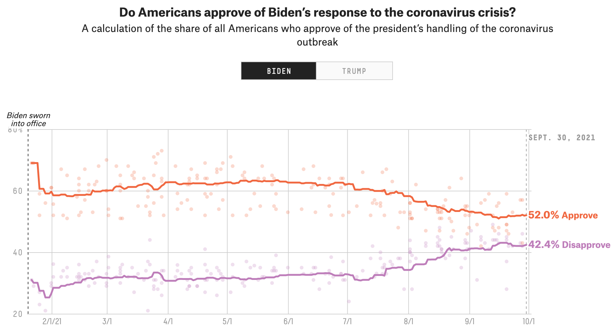
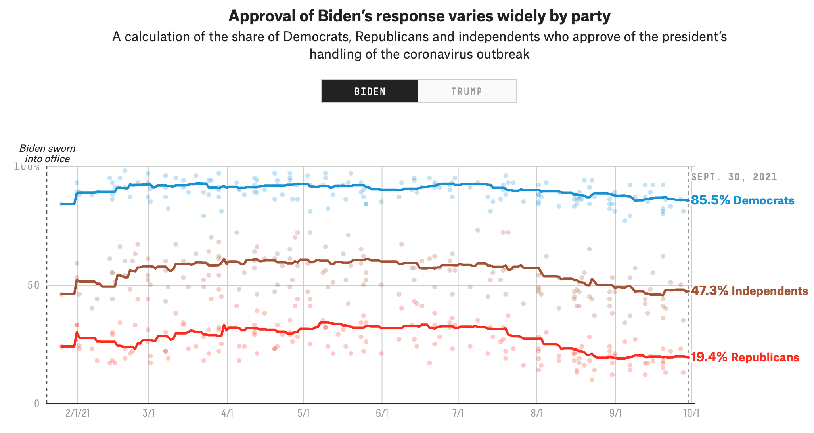
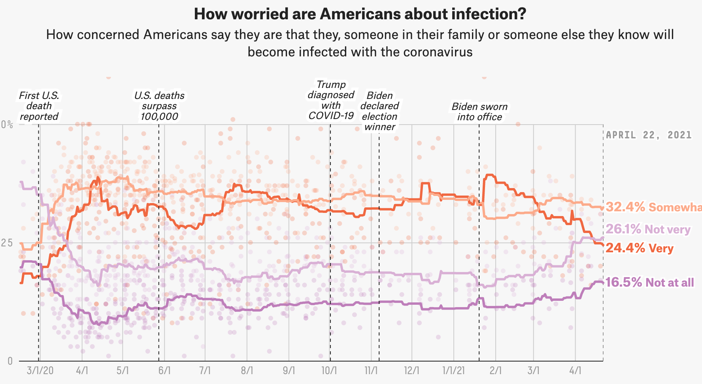
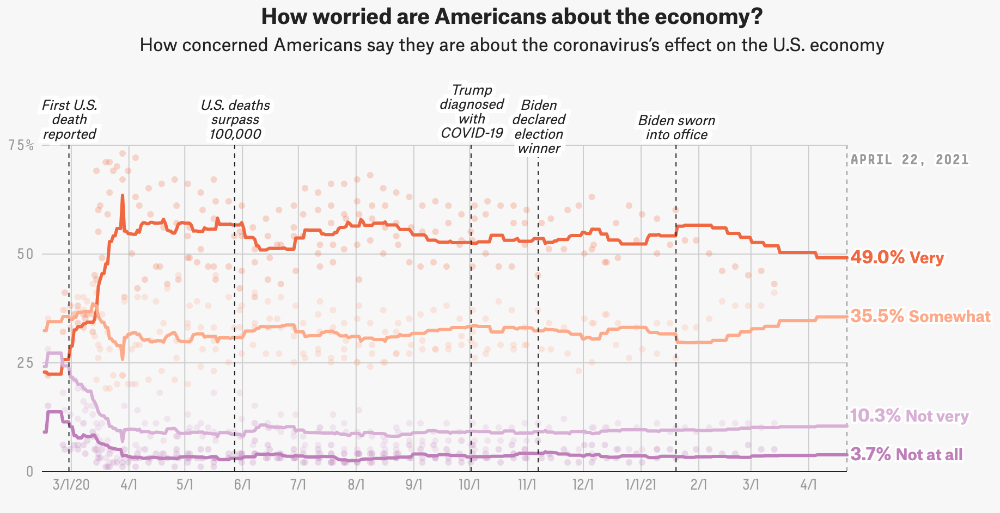

The goal of this exercise is to replicate a more complicated visual chart as accurately as possible.

The link to this data can be found at the hyperlink here:

https://projects.fivethirtyeight.com/coronavirus-polls/

The Original Charts to the data used in this exercise are shown here:






We will attempt to replicate the first chart dealing with the number of Americans who approve of Biden's response to the coronavirus pandemic. First we will need to load the R packages needed:

```{r}
library(tidyverse) #To help manage data
library(dplyr) #to help with creating charts
```

Now we will load the data for examination:

```{r}
#First, we must list the location of the data:
data_location <- here::here('Data', 'covid-19-polls-master', 'covid_approval_toplines.csv' )

#We will now load the data:
mydata <- read_csv(data_location)
```
```
Now we will construct a graph to help illustrate the data visually, and then 
tweak that graph in a way that it resembles the original graph:
```{r}
plot1 <-ggplot(mydata, aes(timestamp, approve_estimate)) +  
          geom_point(size = 0.5) +
          geom_smooth(span = 1) +
          labs(x = NULL, y= NULL) +
        ggtitle(label = "Do Americans approve of Biden’s response to the  coronavirus crisis?",  subtitle = "Biden Sworn into office") +
        theme(plot.title = element_text(size = 12),
        plot.subtitle = element_text(size = 8))
    
  
#Now let us look at our plot to see how it compares to the other 
plot1
```