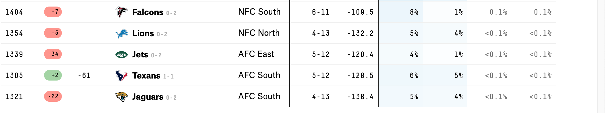

The goal of this exercise is to replicate a more complicated visual chart as accurately as possible.

The link to this data can be found at the hyperlink here:

#https://projects.fivethirtyeight.com/2021-nfl-predictions/

The Original Chart is shown here:



To replicate the chart, first we will need to load the R packages needed:

```{r}
library(tidyverse) #To help manage data
library(dplyr) #to help with creating charts
```

Now we will load the data for examination:

```{r}
NFL_Stats_Location <- here::here('Data', 'nfl-elo', 'nfl_elo.csv' )

#We will now load the data:
NFL_Stats <- read_csv(NFL_Stats_Location)
```

We will now look at the 'structure' of the data, and create a 'summary':

```{r}
str(NFL_Stats)

summary(NFL_Stats)
```

Next we will 'attach' the data so that we can manage it directly with the names of the variables used, which makes data manipulation easier

We will follow this up with the 'head' command which shows the first rows of the data to easily view how the data is being displayed:

```{r}
attach(NFL_Stats)

head(NFL_Stats)
```

#Now we will construct a graph to help illustrate the data visually, and then convert that data in a way that it resembles the original graph:
```{r}
ggplot(NFL_Stats,aes(x = season, y = total_rating, group = team1, team2)) +
  geom_line(aes(color = team1, team2, alpha = 1), size = 2)+
  geom_point(aes(color = team1, team2, alpha = 1), size = 4) +
  scale_y_reverse(breaks = 1:nrow(NFL_Stats))
```


As you can see from our graph, there is so much data that it is congesting the axis, currently, I am not aware of how to eliminate the axis congestion with this many variables, as well as converting the data into a ranked word based list. I will need further study to understand how one would do this.